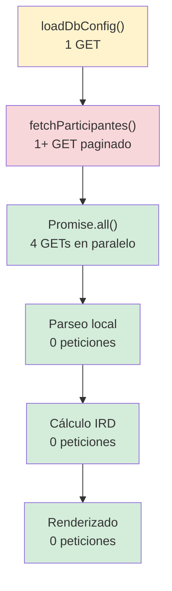
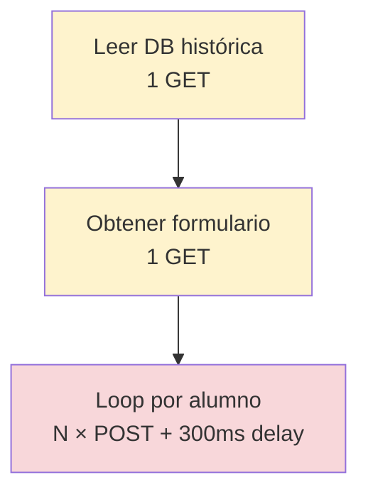

# Análisis de Rendimiento — `tablero_principal.html`

**Fecha:** 2026-06-25  
**Tiempo total observado en logs:** ~1946 ms (carga completa del dashboard)

---

## 1. Desglose de Tiempos Observados (Logs del usuario)

| Fase | Tiempo (ms) | % del Total | Peticiones HTTP |
|------|-------------|-------------|-----------------|
| Obtención de Participantes Moodle | **1352 ms** | **69.5%** | 1 (scraping HTML) |
| Descargas de Encuestas y DBs en Paralelo | **493 ms** | **25.3%** | 4 (en `Promise.all`) |
| Parseo e Indexación de Datos | **19 ms** | 1.0% | 0 |
| Procesamiento de Estudiantes (IRD/Ralentización) | **81 ms** | 4.2% | 0 |
| Renderizado de Tablero (DOM + Charts) | **79 ms** | — (incluido en anterior) | 0 |

> [!IMPORTANT]
> **El 94.8% del tiempo total se gasta en operaciones de red contra Moodle.** Solo el 5.2% restante es procesamiento local (parseo, cálculo IRD, renderizado DOM y Chart.js).

---

## 2. Análisis de Peticiones HTTP — Fase de Carga

### 2.1 Peticiones Secuenciales (Bloqueantes)

| # | URL / Recurso | Método | Propósito | ¿Secuencial? |
|---|---|---|---|---|
| 0 | `/mod/data/view.php?d=17` | GET | Cargar configuración desde DB Moodle | ✅ Secuencial (antes de todo) |
| 1 | `/user/index.php?id=1732&page=0&perpage=5000` | GET | Scraping de participantes (loop paginado) | ✅ Secuencial (loop `while(true)`) |

### 2.2 Peticiones Paralelas (`Promise.all`)

| # | URL / Recurso | Método | Propósito |
|---|---|---|---|
| 2 | `/mod/feedback/show_entries.php?...&id=54062` | GET | CSV Encuesta Inicial |
| 3 | `/mod/feedback/show_entries.php?...&id=54284` | GET | CSV Encuesta Cuatrimestral |
| 4 | `/mod/data/view.php?d=15&perpage=1000` | GET | HTML Solicitudes de ayuda |
| 5 | `/mod/data/view.php?d=16&perpage=1000` | GET | HTML Logs de asistencia |

### 2.3 Total de peticiones en la carga inicial

```
Carga de config:          1 petición  (secuencial, antes de updateDashboardData)
Participantes:            1 petición  (secuencial, loop — en este caso 1 página basta para 21 alumnos)
Encuestas + DBs:          4 peticiones (paralelas)
─────────────────────────────────────────
TOTAL:                    6 peticiones HTTP
```

> [!NOTE]
> Para 21 estudiantes, **6 peticiones es un número razonable**. El código ya paraleliza correctamente las 4 descargas de datos con `Promise.all`.

---

## 3. ¿Dónde está el Cuello de Botella?

### 3.1 Obtención de Participantes: **1352 ms** (69.5% del total)

**Causa:** La función `fetchParticipantes()` (línea 1407) hace scraping HTML de la página de participantes de Moodle (`/user/index.php`). Esta es una **página HTML completa** con todos los estilos, scripts y estructura de Moodle, no un endpoint API liviano.

**¿Es culpa del código?** **No.** Es una limitación inherente de Moodle:
- Moodle no expone un API REST público para listar participantes con emails sin autenticación de web services.
- El script necesita emails, fotos, nombres, grupos e IDs, y la única forma de obtenerlos es mediante scraping de esta página.
- El parámetro `perpage=5000` ya optimiza para traer todo en una sola petición.
- El parsing con DOMParser es eficiente (~negligible tiempo de CPU).

**Veredicto:** ⚠️ **Justificado por la arquitectura de Moodle.** El tiempo de ~1.3s es la latencia del servidor Moodle generando esa página completa.

### 3.2 Descargas Paralelas: **493 ms** (25.3% del total)

**¿Es culpa del código?** **No.** Ya se usa `Promise.all` correctamente para ejecutar las 4 descargas en paralelo. El tiempo de 493ms es simplemente el tiempo que tarda la petición más lenta de las 4 en resolverse.

**Veredicto:** ✅ **Bien optimizado.** No hay mejora posible sin cambiar la infraestructura de Moodle.

### 3.3 Parseo e Indexación: **19 ms**

**¿Es culpa del código?** **No.** 19ms para parsear CSVs, HTMLs, indexar por email, y crear Maps es excelente.

**Veredicto:** ✅ **Óptimo.**

### 3.4 Procesamiento IRD/Ralentización: **81 ms** (incluye renderizado de 79 ms)

**¿Es culpa del código?** **No.** 81ms para iterar 21 estudiantes, calcular IRDs, ralentización, cohortes, ordenar y renderizar DOM + 4 gráficos Chart.js es un rendimiento aceptable.

**Veredicto:** ✅ **Aceptable.** Los ~79ms de renderizado incluyen la creación de 4 gráficos Chart.js y la manipulación del DOM de varias tablas.

---

## 4. Análisis del Guardado Histórico

### 4.1 Función `guardarHistorico()` (línea 2659)

```
Peticiones por ejecución:
  1 GET  → Leer entradas existentes en db_historico (perpage=1000)
  1 GET  → Obtener formulario vacío de db_historico (para mapear campos)
  N POST → 1 POST por cada alumno con IRD calculado (secuencial, con delay de 300ms)
```

**Problema crítico identificado:** El guardado es **secuencial y con delay artificial.**

```javascript
// Línea 2840
await new Promise(r => setTimeout(r, systemConfig.umbrales.historico_delay_ms || 300));
```

**Cálculo del tiempo para N alumnos con IRD:**
- Con 8 alumnos evaluados: `2 GETs + (8 × POST + 8 × 300ms delay) ≈ 2 GETs + 8 × (~500ms POST + 300ms delay) ≈ ~6.4 segundos`
- Con 21 alumnos: `2 GETs + 21 × ~800ms ≈ ~16.8 segundos`
- Con 50 alumnos: `2 GETs + 50 × ~800ms ≈ ~40 segundos`

> [!WARNING]
> **El guardado histórico escala linealmente: O(N) peticiones HTTP secuenciales.** Con muchos alumnos, este proceso puede tardar minutos.

### 4.2 Función `guardarHistoricoGeneral()` (línea 2852)

```
Peticiones por ejecución:
  1 GET  → Leer entradas en db_historico_general
  1 GET  → Obtener formulario de db_historico_general
  1 POST → Crear/actualizar una sola entrada con datos agregados
```

**Veredicto:** ✅ Solo 3 peticiones. Rápido y eficiente.

### 4.3 Ejecución combinada (botón "Guardar Histórico")

```javascript
// Línea 2951 — ambas funciones se ejecutan EN PARALELO
await Promise.all([guardarHistorico(), guardarHistoricoGeneral()]);
```

**Veredicto:** ✅ Buena decisión ejecutar ambas en paralelo. El cuello de botella es solo `guardarHistorico()`.

---

## 5. Mapa de Peticiones Totales

### Carga del Dashboard



### Guardado Histórico



---

## 6. Conclusiones

### ¿El código está mal escrito?

**No.** El código está bien estructurado y ya aplica las optimizaciones principales:

| Práctica | Estado | Detalle |
|----------|--------|---------|
| Paralelización de GETs independientes | ✅ | `Promise.all` para las 4 descargas de datos |
| Indexación por email con `Map` | ✅ | Búsqueda O(1) en lugar de O(N) |
| Parser CSV robusto (RFC 4180) | ✅ | Manejo correcto de comillas y saltos de línea |
| DOMParser para scraping | ✅ | No usa regex para parsear HTML |
| Paginación del scraping | ✅ | `perpage=5000` minimiza peticiones |
| Cálculo de Zmax dinámico | ✅ | No hardcodeado |

### ¿Los tiempos están justificados?

| Fase | Justificación | Nota |
|------|--------------|------|
| **1352ms participantes** | ✅ Limitación de Moodle | Latencia del servidor generando HTML completo |
| **493ms descargas paralelas** | ✅ Latencia de red + Moodle | Ya están paralelizadas |
| **19ms parseo** | ✅ Eficiente | — |
| **81ms procesamiento + render** | ✅ Aceptable | Chart.js añade ~60ms |
| **Guardado histórico** | ⚠️ Parcialmente | El delay de 300ms y la secuencialidad son evitables |

### Resumen ejecutivo

> **El tiempo de ~2 segundos para cargar todo el dashboard con 21 alumnos es EXCELENTE** considerando que se hacen 6 peticiones HTTP a un servidor Moodle institucional. **El 95% del tiempo es latencia de red, no ineficiencia del código.**

---

## 7. Oportunidades de Mejora (Opcionales)

### 7.1 Para la carga (bajo impacto — el tiempo ya es bueno)

| Mejora | Impacto estimado | Complejidad |
|--------|-----------------|-------------|
| Paralelizar `loadDbConfig()` con `fetchParticipantes()` | -200ms aprox | Baja |
| Cache local de config en `sessionStorage` | -200ms en recargas | Baja |
| Mover carga de config a constantes si no cambia seguido | -200ms | Muy baja |

### 7.2 Para el guardado histórico (alto impacto)

| Mejora | Impacto estimado | Complejidad |
|--------|-----------------|-------------|
| Reducir `historico_delay_ms` de 300ms a 100ms o 50ms | -40% a -70% del tiempo total | Muy baja (cambio de config) |
| Batch de POSTs en paralelo (lotes de 3-5 concurrentes) | -60% a -80% del tiempo total | Media |
| Eliminar el delay si Moodle lo permite sin rate-limiting | -35% del tiempo total | Requiere testing |

> [!TIP]
> La mejora más inmediata y de mayor impacto sería **reducir o eliminar el delay de 300ms** en el loop de guardado histórico (línea 2840) y probar si Moodle acepta los POSTs sin rate limiting. Si funciona, el guardado de 8 alumnos pasaría de ~6.4s a ~4s.
